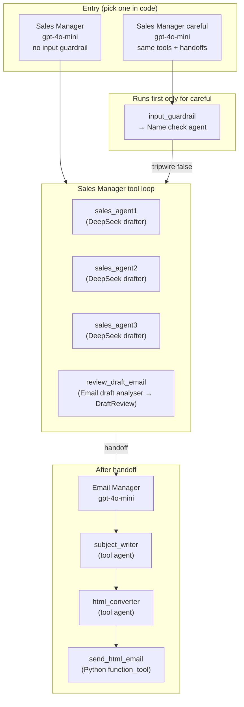
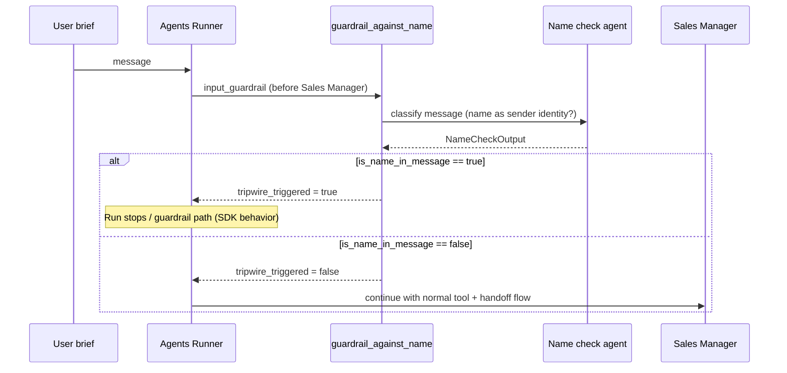
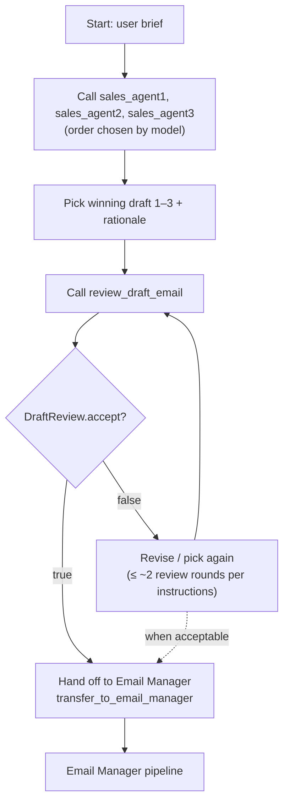
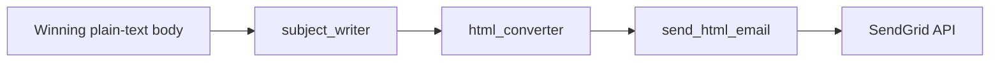
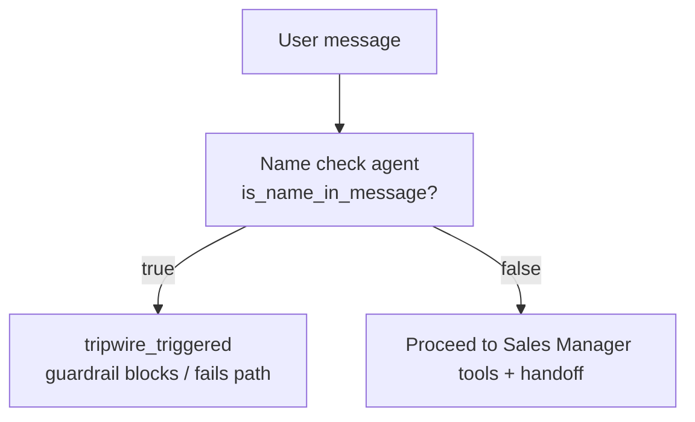

# ComplAI SDR — Multi-agent cold email automation

This project is a **demonstration SDR (Sales Development Rep) workflow** built with the **[OpenAI Agents SDK](https://github.com/openai/openai-agents-python)** (`openai-agents`). A single user **brief** (natural language) is turned into **three alternative email bodies**, **quality-checked with structured output**, optionally **revised**, then **handed off** to an agent that **writes a subject**, **converts to HTML**, and **sends via SendGrid**.

The orchestration — multiple specialist agents exposed as **tools**, **structured review**, **handoffs**, optional **input guardrails**, and **workflow tracing** — lives in `pipeline.py`. The entrypoint `run.py` loads environment variables, passes one hardcoded brief, and prints JSON.

---

## Table of contents

1. [What happens (end-to-end)](#what-happens-end-to-end)
2. [Repository layout](#repository-layout)
3. [Agents and automation graph](#agents-and-automation-graph)
4. [Step-by-step execution](#step-by-step-execution)
5. [Decision graphs](#decision-graphs)
6. [Models and APIs](#models-and-apis)
7. [Environment variables](#environment-variables)
8. [How to run](#how-to-run)
9. [Tracing](#tracing)
10. [Invoking the guardrail variant from code](#invoking-the-guardrail-variant-from-code)

---

## What happens (end-to-end)

| Phase | Who | What |
|--------|-----|------|
| **1. Input** | You / `run.py` | A string brief (e.g. tone, persona, recipient) is the only user message to the top-level agent. |
| **2. Drafting** | Sales Manager (orchestrator) | Calls three **tool-wrapped** drafter agents in parallel conceptually (the model chooses call order). Each returns **body only**, no subject. |
| **3. Selection & review** | Sales Manager + **Email draft analyser** (as tool) | Manager picks draft 1–3, calls `review_draft_email`, which returns **`DraftReview`**: `accept: bool` + `feedback: str`. |
| **4. Revision loop** | Sales Manager (instructed) | If `accept` is false, manager may revise and re-review **up to ~two rounds** (soft limit in instructions), then proceed per judgment. |
| **5. Handoff** | Sales Manager → **Email Manager** | On success path, manager **hands off** so the Email Manager receives the winning body. |
| **6. Send path** | Email Manager | Uses `subject_writer` → `html_converter` → **`send_html_email`** (SendGrid). |
| **7. Output** | `run_sdr_pipeline` | Returns JSON: `final_output`, `last_agent` (name of agent that produced the final message). |

Optional **before phase 1**: if you use the **careful** entry agent, an **input guardrail** runs a small **Name check** agent on the user message; if it decides a **sender-identity name** is present, the guardrail **trips** (`tripwire_triggered`).

---

## Repository layout

| File | Role |
|------|------|
| `pipeline.py` | Builds all agents, tools, handoffs, guardrail; exports `run_sdr_pipeline`. |
| `run.py` | `load_dotenv`, sets `BRIEF`, calls `run_sdr_pipeline(BRIEF)`, prints JSON. |
| `setup_and_run.sh` | Creates venv, installs deps, runs `python run.py`. |
| `requirements.txt` | `openai`, `openai-agents`, `sendgrid`, `python-dotenv`, `pydantic`. |
| `.env.example` | Template for API keys and SendGrid addresses. |

---

## Agents and automation graph

The **top-level runnable agent** is either:

- **`sales_manager`** — same graph, **no** input guardrail (default in `run_sdr_pipeline(..., use_name_guardrail=False)`).
- **`careful`** — **same tools and handoffs**, but with **`input_guardrails=[guardrail_against_name]`** (`use_name_guardrail=True`).

Both are configured with `name="Sales Manager"` in code; the **last_agent** in the result helps distinguish which subgraph completed (e.g. **Email Manager** after handoff).

### High-level agent relations (tools & handoffs)



### Guardrail subgraph (only when `use_name_guardrail=True`)



---

## Step-by-step execution

1. **`run.py`** calls `run_sdr_pipeline(BRIEF)` with the string in `BRIEF`.
2. **`build_agents()`** validates `OPENAI_API_KEY` and `DEEPSEEK_API_KEY`, constructs DeepSeek client + `OpenAIChatCompletionsModel` for the three drafters, wires `gpt-4o-mini` agents for orchestration, review, subject, HTML, and the Email Manager.
3. **`trace(WORKFLOW_TRACE_NAME or "Automated SDR")`** wraps the run for observability (see [Tracing](#tracing)).
4. **`Runner.run(agent, message)`** runs the chosen entry agent (`sales_manager` or `careful`).
5. The **Sales Manager** model executes a **tool loop**: it may call `sales_agent1`, `sales_agent2`, `sales_agent3` (each runs a full sub-agent run and returns text), then chooses a winner and calls `review_draft_email` (the analyser returns structured JSON via `DraftReview`).
6. When satisfied, the model performs a **handoff** to **Email Manager** (SDK `handoffs=[emailer]`).
7. **Email Manager** calls **`subject_writer`**, **`html_converter`**, then **`send_html_email`** with the final subject and HTML body.
8. **`run_sdr_pipeline`** returns `{"final_output": ..., "last_agent": "..."}` after serialization via `_out()`.

---

## Decision graphs

### Sales Manager: draft → review → handoff

Instructions in code tell the manager: get three drafts, pick best, call review; if `accept`, hand off to Email Manager; if not, revise/re-review up to about two rounds, then hand off if appropriate. The **exact branch count** is **model-decided** within those instructions.



### Email Manager: subject → HTML → SendGrid



### Input guardrail decision (optional entry)



---

## Models and APIs

| Component | Model / backend | Notes |
|-----------|-----------------|--------|
| **Drafters** (`sales_agent1`–`3`) | `deepseek-chat` via `AsyncOpenAI(base_url=https://api.deepseek.com/v1)` and `OpenAIChatCompletionsModel` | Three **different instruction sets** (professional / witty / concise). Display names include “Gemini” / “Llama3.3” but **routing uses the same DeepSeek model** — only prompts differ. |
| **Sales Manager**, **Email Manager**, **Email draft analyser**, **Name check**, **subject / html helpers** | `gpt-4o-mini` (OpenAI API, `OPENAI_API_KEY`) | Orchestration, structured `DraftReview`, guardrail check, subject, HTML. |
| **Outbound mail** | SendGrid REST API | `send_html_email` builds `Mail` with HTML content. |

---

## Environment variables

Copy `.env.example` to `.env` and set:

| Variable | Purpose |
|----------|---------|
| `OPENAI_API_KEY` | OpenAI API for `gpt-4o-mini` agents. |
| `DEEPSEEK_API_KEY` | DeepSeek API for drafting agents. |
| `SENDGRID_API_KEY` | Sending mail. |
| `SENDGRID_FROM_EMAIL` | Verified sender. |
| `SENDGRID_TO_EMAIL` | Recipient for this demo. |
| `WORKFLOW_TRACE_NAME` | Optional; overrides default trace name `"Automated SDR"` in `run_sdr_pipeline`. |

---

## How to run

```bash
cp .env.example .env
# edit .env

chmod +x setup_and_run.sh
./setup_and_run.sh
```

Or manually: `python3 -m venv .venv` → `source .venv/bin/activate` → `pip install -r requirements.txt` → `python run.py`.

**Ubuntu/Debian:** if `python3 -m venv` fails, install `python3-venv` / `python3.X-venv` (see previous README notes in this file’s history). Broken `.venv`: `rm -rf .venv` and rerun `./setup_and_run.sh`.

To change the campaign brief, edit **`BRIEF`** in `run.py`.

---

## Tracing

`run_sdr_pipeline` wraps execution in:

```python
with trace(name):  # name from WORKFLOW_TRACE_NAME or "Automated SDR"
    result = await Runner.run(agent, message)
```

This aligns with the Agents SDK tracing helpers so you can correlate runs in supported tracing setups.

---

## Invoking the guardrail variant from code

Default **`run.py`** uses the Sales Manager **without** the name guardrail. To enable it:

```python
result = await run_sdr_pipeline(BRIEF, use_name_guardrail=True)
```

When the guardrail trips, behavior follows the SDK’s guardrail semantics for blocked input (no normal completion through the Sales Manager).

---

## Summary

- **Automation style:** one **orchestrator** agent with **sub-agents as tools**, a **structured reviewer tool**, **handoff** to a **sender** agent, optional **input guardrail**, and **tracing**.
- **Deliverable:** a real email sent through **SendGrid** from a single natural-language brief — useful as a learning/demo baseline; production use would add approvers, suppression lists, rate limits, and clearer naming/model parity.
