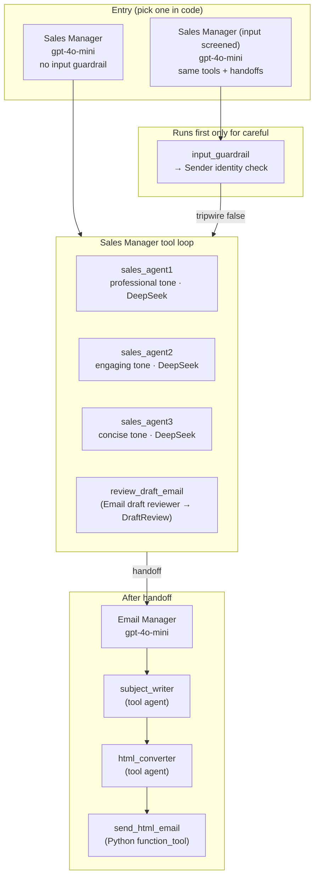
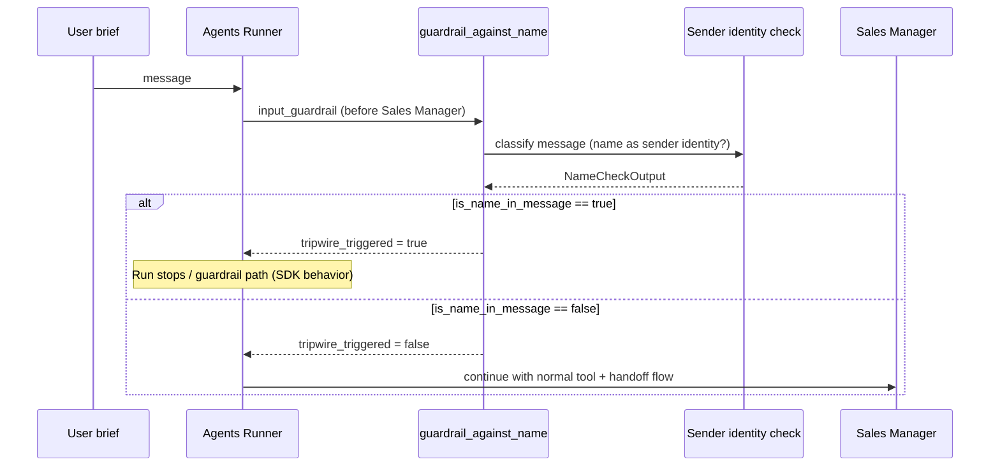
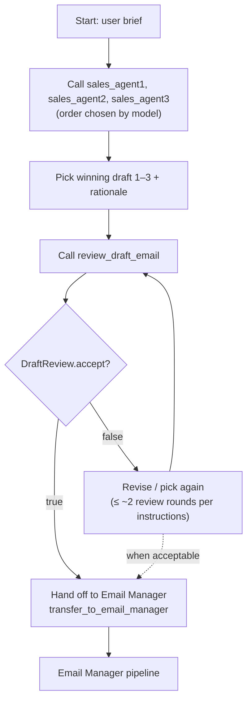
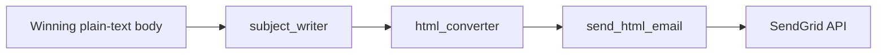
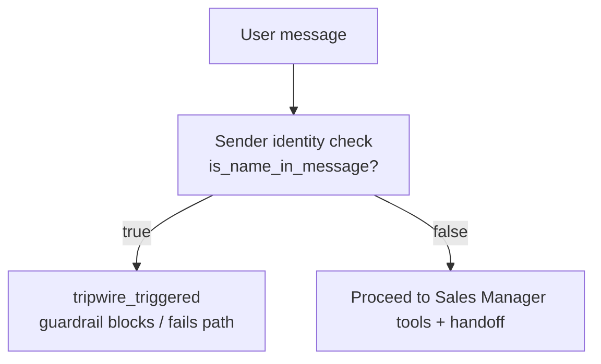

# ComplAI SDR — Multi-agent cold email automation

This project is a **demonstration SDR (Sales Development Rep) workflow** built with the **[OpenAI Agents SDK](https://github.com/openai/openai-agents-python)** (`openai-agents`). A single user **brief** (natural language) is turned into **three alternative email bodies**, **quality-checked with structured output**, optionally **revised**, then **handed off** to an agent that **writes a subject**, **converts to HTML**, and **sends via SendGrid**.

The orchestration — multiple specialist agents exposed as **tools**, **structured review**, **handoffs**, optional **input guardrails**, **workflow tracing**, **Telegram step updates**, and a **FastAPI webhook** — lives mainly in `pipeline.py`, `telegram_util.py`, and `webhook_app.py`. The entrypoint `run.py` loads environment variables, sets `USER_MESSAGE`, and prints JSON.

**→ Local install, `.env`, and running on your laptop:** **[SETUP_LOCAL.md](SETUP_LOCAL.md)**

---

## Table of contents

1. [What happens (end-to-end)](#what-happens-end-to-end)
2. [Repository layout](#repository-layout)
3. [Agents and automation graph](#agents-and-automation-graph)
4. [Step-by-step execution](#step-by-step-execution)
5. [Decision graphs](#decision-graphs)
6. [Models and APIs](#models-and-apis)
7. [Tracing](#tracing)
8. [Invoking the guardrail variant from code](#invoking-the-guardrail-variant-from-code)
9. [Summary](#summary)

---

## What happens (end-to-end)

| Phase | Who | What |
|--------|-----|------|
| **0. Parse** | **Input parser** (`ParsedInput`) | `run.py` passes one **natural-language** string. The parser extracts **`recipient_email`** + **`brief`** (strict email validation afterward). |
| **1. SDR input** | Sales Manager (orchestrator) | Receives **`brief`** only (not the raw NL). Optional guardrail still applies to this brief. |
| **2. Drafting** | Sales Manager (orchestrator) | Calls three **tool-wrapped** drafter agents in parallel conceptually (the model chooses call order). Each returns **body only**, no subject. |
| **3. Selection & review** | Sales Manager + **Email draft reviewer** (as tool) | Manager picks draft 1–3, calls `review_draft_email`, which returns **`DraftReview`**: `accept: bool` + `feedback: str`. |
| **4. Revision loop** | Sales Manager (instructed) | If `accept` is false, manager may revise and re-review **up to ~two rounds** (soft limit in instructions), then proceed per judgment. |
| **5. Handoff** | Sales Manager → **Email Manager** | On success path, manager **hands off** so the Email Manager receives the winning body. |
| **6. Send path** | Email Manager | Uses `subject_writer` → `html_converter` → **`send_html_email`** (SendGrid). |
| **7. Output** | `run_sdr_pipeline` | Returns JSON: **`recipient_email`**, **`steps`**, `final_output`, `last_agent`. Parsing errors add **`❌ Could not find a valid email…`** to `steps` (and Telegram if configured). |

Optional **before drafting**: with **`Sales Manager (input screened)`**, an **input guardrail** runs the **Sender identity check** on the **`brief`** (not the raw NL containing the email); if a **sender-identity name** is present, the guardrail **trips** (`tripwire_triggered`).

---

## Repository layout

| File | Role |
|------|------|
| `pipeline.py` | Builds all agents, tools, handoffs, guardrail; exports `run_sdr_pipeline`. |
| `telegram_util.py` | `send_telegram_message`, `log_step`, per-run `steps` context (`bind_steps_list` / `steps_reset`). |
| `webhook_app.py` | FastAPI `POST /telegram-webhook` → `run_sdr_pipeline`. |
| `run.py` | `load_dotenv`, sets `USER_MESSAGE` (natural language), calls `run_sdr_pipeline`, prints JSON. |
| `SETUP_LOCAL.md` | **Local** setup, `.env`, scripts, optional Telegram dev server. |
| `setup_and_run_local.sh` | Local / macOS: venv + deps + `run.py` (no `apt` / `sudo`). |
| `setup_and_run_aws.sh` | Ubuntu / Debian / EC2: installs `python3-venv` via `apt` if needed, then same. |
| `setup_and_run.sh` | Alias for **`setup_and_run_local.sh`** (backward compatible). |
| `requirements.txt` | `openai`, `openai-agents`, `sendgrid`, `python-dotenv`, `pydantic`, `requests`, `fastapi`, `uvicorn`. |
| `.env.example` | Template for API keys and SendGrid / Telegram variables. |

---

## Agents and automation graph

The **top-level runnable agent** is either:

- **`sales_manager`** — same graph, **no** input guardrail (default in `run_sdr_pipeline(..., use_name_guardrail=False)`).
- **`careful`** — **same tools and handoffs**, but with **`input_guardrails=[guardrail_against_name]`** (`use_name_guardrail=True`).

Entry agents use distinct names in traces: **`Sales Manager`** (default) vs **`Sales Manager (input screened)`** when the guardrail is enabled. After a successful handoff, **last_agent** is typically **Email Manager**.

### High-level agent relations (tools & handoffs)



### Guardrail subgraph (only when `use_name_guardrail=True`)



---

## Step-by-step execution

1. **`run.py`** calls `run_sdr_pipeline(USER_MESSAGE)` with natural language (contains recipient + instructions).
2. **`_input_parser_agent()`** + **`Runner.run`** produce **`ParsedInput`**; invalid/missing email short-circuits with error **steps** / Telegram line.
3. **`build_agents(recipient_email=...)`** validates `OPENAI_API_KEY` and `DEEPSEEK_API_KEY`, constructs DeepSeek client + `OpenAIChatCompletionsModel` for the three drafters, wires `gpt-4o-mini` agents for orchestration, review, subject, HTML, and the Email Manager.
4. **`trace(WORKFLOW_TRACE_NAME or "Automated SDR")`** wraps the run for observability (see [Tracing](#tracing)).
5. **`Runner.run(agent, brief, hooks=DemoRunHooks)`** runs the chosen entry agent; hooks drive **`log_step`** / Telegram live lines.
6. The **Sales Manager** model executes a **tool loop**: it may call `sales_agent1`, `sales_agent2`, `sales_agent3` (each runs a full sub-agent run and returns text), then chooses a winner and calls `review_draft_email` (structured **`DraftReview`**).
7. When satisfied, the model performs a **handoff** to **Email Manager** (SDK `handoffs=[emailer]`).
8. **Email Manager** calls **`subject_writer`**, **`html_converter`**, then **`send_html_email`** with the final subject and HTML body to the **parsed** recipient (or env fallback).
9. **`run_sdr_pipeline`** returns **`recipient_email`**, **`steps`**, **`final_output`** (via `_out()`), **`last_agent`**.

---

## Decision graphs

### Sales Manager: draft → review → handoff

Instructions in code tell the manager: get three drafts, pick best, call review; if `accept`, hand off to Email Manager; if not, revise/re-review up to about two rounds, then hand off if appropriate. The **exact branch count** is **model-decided** within those instructions.



### Email Manager: subject → HTML → SendGrid



### Input guardrail decision (optional entry)



---

## Models and APIs

| Component | Model / backend | Notes |
|-----------|-----------------|--------|
| **Drafters** (`sales_agent1`–`3`) | `deepseek-chat` via `AsyncOpenAI(base_url=https://api.deepseek.com/v1)` and `OpenAIChatCompletionsModel` | Three **ComplAI drafter** roles: professional, engaging, and concise tone. **Same DeepSeek model**, different system instructions. |
| **Sales Manager**, **Email Manager**, **Email draft reviewer**, **Sender identity check**, **Subject line writer**, **HTML body formatter**, **Input parser** | `gpt-4o-mini` (OpenAI API, `OPENAI_API_KEY`) | Orchestration, structured outputs, guardrail, subject, HTML. |
| **Outbound mail** | SendGrid REST API | `send_html_email` builds `Mail` with HTML content. |
| **Telegram** (optional) | Bot HTTP API | `send_telegram_message` in `telegram_util.py`. |

---

## Tracing

`run_sdr_pipeline` wraps execution in:

```python
with trace(name):  # name from WORKFLOW_TRACE_NAME or "Automated SDR"
    ...
```

This aligns with the Agents SDK tracing helpers so you can correlate runs in supported tracing setups.

---

## Invoking the guardrail variant from code

Default **`run.py`** uses the Sales Manager **without** the name guardrail. To enable it:

```python
result = await run_sdr_pipeline(USER_MESSAGE, use_name_guardrail=True)
```

When the guardrail trips, behavior follows the SDK’s guardrail semantics for blocked input (no normal completion through the Sales Manager).

---

## Summary

- **Automation style:** one **orchestrator** agent with **sub-agents as tools**, a **structured reviewer tool**, **handoff** to a **sender** agent, optional **input guardrail**, **tracing**, and optional **Telegram** step streaming via **`log_step`**.
- **Deliverable:** a real email sent through **SendGrid** from a single natural-language request — useful as a learning/demo baseline; production use would add approvers, suppression lists, rate limits, and stronger deliverability/compliance controls.
